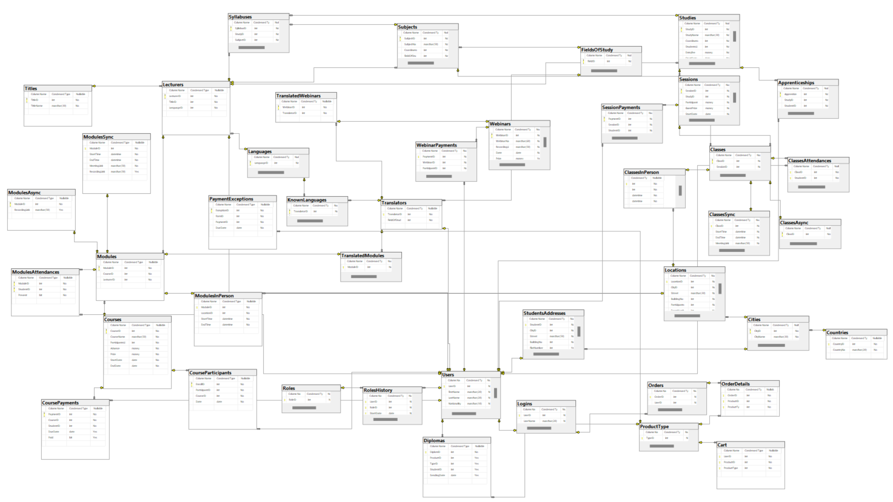

# Database systems project
This project was a collaborative effort between <a href="https://github.com/paula078">Paulina</a>, <a href="https://github.com/king-zar">Kinga</a> and myself for the Database Systems course at AGH University during the academic year 2023/2024.

The primary objective of the project was to design and implement a database for a company offering a diverse range of studies, courses, and webinars.

The project encompassed the following stages:
- creating the database from scratch 
- inserting exemplary data into each table
- developing views, functions, procedures, and triggers.
- 
The complete project description can be found in "documentation.pdf" file.

Below is the ER diagram of the created database:

